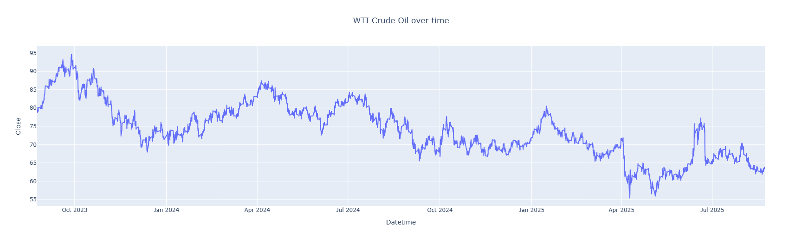

## FX-BOT : Automated Forex Market Analysis Using Machine Learning Algorithms (Where Code Meets Currency).

### 1. Project Description :

The FX-BOT aims to develop an intelligent, automated system for analyzing the foreign exchange (forex) market using advanced machine learning algorithms. The system is designed to collect, process, and analyze real-time and 

historical forex data in order to generate meaningful insights and predictive signals for trading and investment strategies. FX-BOT leverages ML models to detect market patterns and forecast currency movements based on 

historical data. It is built to operate efficiently in a command-line environment, making it lightweight and adaptable for deployment in various environments including cloud servers and low-resource systems.

Key features of the system include:

* Real-time forex data collection and preprocessing

* Technical indicators and feature engineering

* Predictive modeling using machine learning techniques (e.g., decision trees, random forest, xg-boost etc)

* Visualizations and performance metrics for model evaluation

By bridging the gap between raw currency market data and actionable trading intelligence, FX-BOT embodies the convergence of financial analysis, and AI. The ultimate goal 

is to provide a scalable foundation for building smarter, more responsive forex trading systems.

* Reference Link to the Currency Pairs for this project:
[Forex Currency Pairs](https://finance.yahoo.com/markets/currencies/)


```
 <tree>
├── 01.fx_analysis
│   ├── bitcoin_plot.png
│   ├── brent_crude_plot.png
│   ├── eurusd_plot.png
│   ├── forex_df_combined_2025_08_27.parquet.brotli
│   ├── fxPAIRS.ipynb
│   ├── fxpairs_plot.png
│   ├── gold_plot.png
│   ├── volatility_index_plot.png
│   └── wti_crude_plot.png
├── 02.fx_modelling
│   ├── forex_df_models_2025_08_27.parquet.brotli
│   └── fxPAIRS_models.ipynb
├── 03.fx_trading_simulations
│   ├── forex_df_models_2025_08_27.parquet.brotli
│   ├── fxPAIRS_Trading&Simulations.ipynb
│   └── prediction_plot.png
├── 04.deployment_automation
│   ├── deployment.yaml
│   ├── dockerfile
│   ├── entrypoint.sh
│   ├── local_data
│   │   ├── indexes_df.parquet
│   │   ├── macro_df.parquet
│   │   ├── tickers_df.parquet
│   │   ├── transformed_df.parquet
│   │   └── xgboost_model.joblib
│   ├── main.py
│   ├── requirements.txt
│   ├── scripts
│   │   ├── __pycache__
│   │   │   ├── data_repo.cpython-311.pyc
│   │   │   ├── train.cpython-311.pyc
│   │   │   └── transform.cpython-311.pyc
│   │   ├── data_repo.py
│   │   ├── train.py
│   │   └── transform.py
│   ├── service.yml
│   └── streamlit_app.py
├── README.md
├── diagram.svg
├── local_data
│   ├── indexes_df.parquet
│   ├── macro_df.parquet
│   ├── tickers_df.parquet
│   ├── transformed_df.parquet
│   └── xgboost_model.joblib
├── streamlit_app.py
└── streamlit_visuals.mp4
```

### 2. Environment Setup on Local Machine Terminal and Requirements Installation.

```bash
mkdir fx-BOT

conda create -n fx-BOT python=3.11

conda activate fx-BOT
```

### 3. Data Extraction, Preprocessing and Analysis. 
[fxPairs notebook](01.fx_analysis/fxPAIRS.ipynb) - Cross-Industry Standard Process for Data Mining (CRISP-DM). 

***Macro Indicators:***

* 
* 
* 
* 
* 
* 
* 


### 4. Machine Learning Algorithms on FX Currency Pairs Data
[fxPairs Models](02.fx_modelling/fxPAIRS_models.ipynb)

### 5. Trading and Simulations
[fxPairs simulation](03.fx_trading_simulations/fxPAIRS_Trading&Simulations.ipynb)

### 6. Deployment and Automation
* [data repo](04.deployment_automation/scripts/data_repo.py)
* [data transformation](04.deployment_automation/scripts/transform.py)
* [train script](04.deployment_automation/scripts/train.py)

```bash
pip install -r requirements.txt

python3 main.py
```
* 

***Note***: Local directory to be created when ``main.py`` is run.

### Docker and Kubernetes Local Deployment

* build and run docker image:

[Dockerfile](04.deployment_automation/dockerfile) with an [Entry Point](04.deployment_automation/entrypoint.sh)

```bash
docker build -t fxbot:v1 .

docker run -it --rm -p 8501:8501 fxbot:v1    

http://localhost:8501/       # open the link to see downloaded data
```

* create [deployment_file](04.deployment_automation/deployment.yaml)

```bash
kind create cluster

kubectl cluster-info --context kind-kind

kubectl get service

kubectl get deployment

kind load docker-image fxbot:v1  # from docker desktop

kubectl apply -f deployment.yaml

kubectl get deployment             # you see ready deployment

kubectl get pods                 # you should see running pods

kubectl describe pod <pod name>

kubectl describe pod <pod name> | less

q     # exit 

kubectl exec -it <pod name> -- ls -l /app      # list contents of the container

kubectl port-forward <pod_name> 8501:8501

http://localhost:8501/       # open the link to see downloaded data
```

* create [service_file](04.deployment_automation/service.yml)

```bash
kubectl apply -f service.yml

kubectl get service         # service or svc

kubectl describe service myapp

kubectl get endpoints myapp

kubectl port-forward service/myapp 8080:80   # or Stop current port-forward with Ctrl+C, then: (kubectl port-forward <pod name> 8080:8501)

http://localhost:8080/
```
